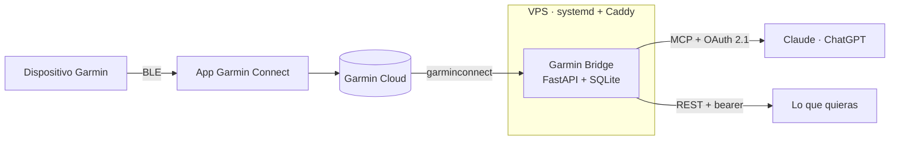

<div align="center">

# Garmin Bridge

**Tus datos de Garmin, dentro de tu asistente.**

Conecta Garmin Connect con Claude o ChatGPT por MCP. El asistente lee tu sueño,
tu HRV y tu recuperación, y escribe entrenamientos estructurados en tu cuenta.

[**garmin.cryptoaiarena.com**](https://garmin.cryptoaiarena.com)


</div>

---

## Qué hace

No es un cuadro de mandos más. Es la **fontanería** que le da a un modelo acceso
a tus métricas reales y capacidad de escribir en tu cuenta de Garmin.

La inteligencia no vive aquí: las herramientas entregan datos limpios y ejecutan
órdenes, y decidir qué entrenamiento toca es trabajo del modelo.

> «¿Cómo he dormido esta semana? Con eso, móntame la sesión de mañana y prográmamela.»

El asistente mira tu readiness, tu HRV y tu carga reciente, propone la sesión, y
la deja en tu calendario de Garmin con cada ejercicio identificado y su grupo
muscular.

## Cómo se conecta

1. **Consigue una invitación.** El servicio es cerrado.
2. **Crea tu cuenta y vincula Garmin**, desde el navegador.
3. **Añade el conector** en tu asistente:

   ```
   https://garmin.cryptoaiarena.com/mcp
   ```

   En Claude: `Configuración → Conectores → Añadir conector personalizado`.

4. **Autoriza.** Se abre una ventana para iniciar sesión. Ya está.

## Herramientas

| Lectura | |
|---|---|
| `get_today` | La foto de hoy: sueño, HRV, Body Battery, readiness |
| `get_metrics(days)` | Serie diaria de las ~15 métricas accionables |
| `get_activities(days)` | Sesiones con FC media, ritmo y training effect |
| `get_activity(id)` | Una sesión al detalle, con sus series |
| `get_weight(days)` | Pesajes del periodo, con la media y el cambio |
| `get_devices` | Qué Garmin hay vinculados y su última sincronización |

| Corregir lo ya hecho | |
|---|---|
| `update_activity_sets(id, sets)` | Reescribe las series: ejercicio, repeticiones y peso |
| `update_activity(id, ...)` | Arregla el nombre, el deporte o la nota |
| `add_activity(...)` | Da de alta a mano lo que el reloj no llegó a grabar |
| `log_weight(kg)` | Apunta un pesaje sin abrir la app |

| Entrenamientos | |
|---|---|
| `create_workout(spec)` | Crea uno estructurado y opcionalmente lo programa |
| `get_workout(id)` | Su contenido, con la misma forma que acepta `create_workout` |
| `update_workout(id, spec)` | Lo reemplaza sin sacarlo del calendario |
| `delete_workout(id)` · `list_workouts` | |

| Catálogo y calendario | |
|---|---|
| `find_exercises(term)` | Busca en los **1527 ejercicios** de Garmin |
| `list_muscle_groups` | Las 47 categorías, que son los grupos musculares |
| `list_scheduled(year, month)` · `schedule_workout` · `unschedule_workout` | |

**Los ejercicios de fuerza se identifican de verdad.** Cada paso lleva su
`category` de Garmin —el grupo muscular— en vez de quedar descrito en las notas,
que es texto libre que después no se puede agregar ni analizar.

```jsonc
{"kind": "interval", "exercise": "Barbell Bench Press", "reps": 8, "weight_kg": 40}
// → category: BENCH_PRESS · exerciseName: BARBELL_BENCH_PRESS
```

**Y lo que el reloj no supo, se lo cuentas después.** Una pulsera sin pantalla
detecta que te mueves y cuenta repeticiones a ojo, pero no sabe si eso era press
de banca o remo, ni con cuántos kilos: guarda la serie como `UNKNOWN` y sin
carga. Al decírselo al asistente, la sesión pasa a contar en su grupo muscular y
el peso queda registrado.

> «En la sesión de ayer las dos primeras series eran press de banca con 40, y la
> tercera no la contó.»

## Arquitectura



Los datos salen de **Garmin Connect**, no del dispositivo: funciona con
cualquier Garmin que vincules —Fénix, Forerunner, Edge, Cirqa— sin tocar código.

| | |
|---|---|
| **API y MCP** | FastAPI, servidor MCP por HTTP con streaming |
| **Caché** | SQLite, particionada por usuario |
| **Auth** | OAuth 2.1 con PKCE y registro dinámico de clientes |
| **Sincronización** | APScheduler, horaria con backfill de 7 días |

## Seguridad

Guardar datos de salud y credenciales de terceros obliga a ser serio:

- **Multiusuario aislado.** `user_id` en la clave primaria de cada tabla y un
  cliente de Garmin por usuario. Si no hay identidad en contexto, la petición
  **falla** en vez de caer a una cuenta por defecto: un descuido corta el
  servicio en lugar de filtrar datos ajenos.
- **Tokens de Garmin cifrados** con Fernet. Nunca tocan el disco en claro.
- **Contraseñas con scrypt**; códigos y tokens OAuth se guardan hasheados. Una
  copia de la base no permite suplantar a nadie.
- **Códigos de un solo uso** y rotación del refresh token, como pide OAuth 2.1.
- **Alta solo por invitación**, de un uso y con caducidad. No hay registro
  abierto.
- **TLS de punta a punta.** Certificado propio, sin tramos en claro.
- **La contraseña de Garmin nunca pasa por el modelo.** Se pide en una página
  del navegador, no con una herramienta MCP: si se pidiera ahí, quedaría escrita
  en el historial de la conversación.

## Administración

```bash
python -m app.admin invitar [email]     # enlace de invitación de un solo uso
python -m app.admin usuarios            # quién hay dado de alta
python -m app.admin admin <user_id>     # da acceso al panel
python -m app.admin borrar <user_id>    # borra la cuenta y todos sus datos
```

También hay panel web en `/admin`, con las mismas comprobaciones.

## Autoalojarlo

Ver **[DEPLOY.md](DEPLOY.md)**: venv, systemd y Caddy delante. El repo trae
además `Dockerfile` y `docker-compose.yml` para una máquina dedicada.

```bash
cp .env.example .env    # token, clave de cifrado, dominio
python -m app.admin invitar tu@email.com
```

**`GB_ENCRYPTION_KEY` es crítica**: si se pierde, todos los usuarios tienen que
volver a vincular Garmin. Guárdala separada de la base de datos, o el cifrado no
protege de nada.

## Avisos

- **La librería es no oficial.** [`garminconnect`](https://github.com/cyberjunky/python-garminconnect)
  usa endpoints internos y Garmin puede romperla en cualquier actualización. El
  acoplamiento está aislado en `garmin_client.py` y `workouts.py`: migrar a la
  API oficial solo tocaría esos dos.
- **No hagas login en bucle.** Garmin limita por IP. La librería encadena cinco
  estrategias, así que es normal ver fallar las primeras; insistir solo alarga
  el bloqueo.
- **Los entrenamientos se ven en la app**, no siempre en la muñeca: depende de
  si tu dispositivo tiene pantalla.

