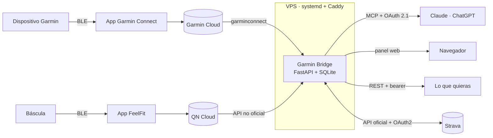

<div align="center">

# Garmin Bridge

**Tus datos de Garmin, dentro de tu asistente.**

Conecta Garmin Connect con Claude o ChatGPT por MCP. El asistente lee tu sueño,
tu HRV y tu recuperación, y escribe entrenamientos estructurados en tu cuenta.

[**garmin.cryptoaiarena.com**](https://garmin.cryptoaiarena.com)


</div>

---

## Qué hace

Es la **fontanería** que le da a un modelo acceso a tus métricas reales y
capacidad de escribir en tu cuenta de Garmin, más un **panel** donde ves tus
datos y lo que el asistente ha concluido de ellos.

La inteligencia no vive aquí: las herramientas entregan datos limpios y ejecutan
órdenes, y decidir qué entrenamiento toca es trabajo del modelo.

> «¿Cómo he dormido esta semana? Con eso, móntame la sesión de mañana y prográmamela.»

El asistente mira tu readiness, tu HRV y tu carga reciente, propone la sesión, y
la deja en tu calendario de Garmin con cada ejercicio identificado y su grupo
muscular.

## Cómo se conecta

1. **Consigue una invitación.** El servicio es cerrado.
2. **Crea tu cuenta y vincula Garmin**, desde el navegador.
3. **Añade el conector** en tu asistente:

   ```
   https://garmin.cryptoaiarena.com/mcp
   ```

   En Claude: `Configuración → Conectores → Añadir conector personalizado`.

4. **Autoriza.** Se abre una ventana para iniciar sesión. Ya está.

A partir de ahí tienes las dos mitades: el asistente, en tu conversación, y tu
**panel** en `/panel`, con la misma cuenta.

## Herramientas

| Lectura | |
|---|---|
| `get_today` | La foto de hoy: sueño, HRV, Body Battery, readiness |
| `get_metrics(days)` | Serie diaria de las ~15 métricas accionables, calorías del día incluidas |
| `get_activities(days)` | Sesiones con FC media, ritmo y training effect |
| `get_activity(id)` | Una sesión al detalle, con sus series |
| `get_activity_hr(id)` | La curva de pulso de una sesión y sus minutos por zona |
| `get_exercise_history(ejercicio, days)` | Con cuánto peso, cuántas series y cuánto volumen, sesión a sesión |
| `get_weight(days)` | Pesajes del periodo, con la media y el cambio |
| `get_body_composition(days)` | Peso, grasa, músculo y agua de tu báscula, con la tendencia semanal |
| `get_devices` | Qué Garmin hay vinculados y su última sincronización |
| `sync_now(days)` | Fuerza la descarga desde Garmin en vez de usar la caché |

| Corregir lo ya hecho | |
|---|---|
| `update_activity_sets(id, sets)` | Reescribe las series: ejercicio, repeticiones y peso |
| `update_activity(id, ...)` | Arregla el nombre, el deporte, la nota y los totales (distancia, duración, calorías, desnivel, hora) |
| `add_activity(...)` | Da de alta a mano lo que el reloj no llegó a grabar |
| `log_weight(kg)` | Apunta un pesaje sin abrir la app |
| `sync_activity_to_strava(id)` | Lleva a Strava una corrección que ya hiciste en Garmin |

| Entrenamientos | |
|---|---|
| `create_workout(spec)` | Crea uno estructurado y opcionalmente lo programa |
| `get_workout(id)` | Su contenido, con la misma forma que acepta `create_workout` |
| `update_workout(id, spec)` | Lo reemplaza sin sacarlo del calendario |
| `delete_workout(id)` · `list_workouts` | |

| Catálogo y calendario | |
|---|---|
| `find_exercises(term)` | Busca en los **1527 ejercicios** de Garmin |
| `list_muscle_groups` | Las 47 categorías, que son los grupos musculares |
| `list_scheduled(year, month)` · `schedule_workout` · `unschedule_workout` | |

| Dejar constancia | |
|---|---|
| `save_insight(insight)` | Guarda una conclusión: sale en el panel del usuario |
| `list_insights(limit, kind)` | Lo que ya se había concluido, para recuperar el hilo |
| `delete_insight(id)` | Retira una que resultó estar equivocada |

**Los ejercicios de fuerza se identifican de verdad.** Cada paso lleva su
`category` de Garmin —el grupo muscular— en vez de quedar descrito en las notas,
que es texto libre que después no se puede agregar ni analizar.

```jsonc
{"kind": "interval", "exercise": "Barbell Bench Press", "reps": 8, "weight_kg": 40}
// → category: BENCH_PRESS · exerciseName: BARBELL_BENCH_PRESS
```

**Y lo que el reloj no supo, se lo cuentas después.** Una pulsera sin pantalla
detecta que te mueves y cuenta repeticiones a ojo, pero no sabe si eso era press
de banca o remo, ni con cuántos kilos: guarda la serie como `UNKNOWN` y sin
carga. Al decírselo al asistente, la sesión pasa a contar en su grupo muscular y
el peso queda registrado.

> «En la sesión de ayer las dos primeras series eran press de banca con 40, y la
> tercera no la contó.»

## El panel

En `/panel`, con la sesión del navegador. Estilo WHOOP: negro, tres anillos y
los números grandes, pensado para mirarlo en el móvil al levantarse.

| | |
|---|---|
| **Hoy** | Recuperación, sueño y Body Battery en anillos; **el análisis de la IA justo debajo**; y cada métrica comparada con tu media de 30 días |
| **Tendencias** | Nueve series a 7, 30 o 90 días, con los huecos a la vista: si un día no hay dato, se ve que no lo hay |
| **Sesiones** | Lo que grabó el reloj, con FC, calorías y efecto de entrenamiento |
| **Cuerpo** | Peso y composición de la báscula, con la tendencia semanal |
| **Análisis** | Todo lo que el asistente ha dejado escrito, fechado y con sus números |
| **Ajustes** | Estado de Garmin y de la báscula, dirección del conector y perfil de entrenamiento |

**Lo que la IA analiza se queda por escrito.** Es lo único que no sale de
Garmin: cuando el modelo llega a una conclusión que merece releerse llama a
`save_insight`, y ahí sigue un mes después, cuando ya no queda ni rastro de
aquella conversación. Con `list_insights` el modelo también recupera el hilo en
vez de empezar de cero cada vez.

> «Mira cómo he dormido esta semana y déjamelo apuntado.»

Sin dependencias ni compilación: HTML, una hoja de estilo y un fichero de
JavaScript servidos por el propio FastAPI. En el móvil la navegación se va a una
barra inferior, donde llega el pulgar.

## Báscula inteligente

Garmin solo conoce el peso que tecleas a mano. Si vinculas tu báscula de
bioimpedancia, el asistente ve además **grasa, músculo, agua, hueso, IMC y
metabolismo basal**, medidos todos los días. Es lo que distingue adelgazar de
perder lo que estabas construyendo: dos kilos menos con la grasa igual son dos
kilos de músculo.

Se vincula en `/vincular-bascula`, eligiendo marca. Hoy hay una:

| Proveedor | Nube |
|---|---|
| **FeelFit** | `feelfit.qnclouds.com` (básculas QN Cloud) |

Como con Garmin, la contraseña se usa una vez para conseguir un permiso y no se
guarda; el permiso queda cifrado. Añadir otra marca es escribir su módulo
—`iniciar_sesion`, `medidas`, `dispositivos`— y una línea en `scales.py`.

> «¿Estoy perdiendo grasa o músculo este mes?»

## Strava

Garmin exporta cada sesión a Strava **una sola vez, al grabarla**. Si el reloj
solo detectó una serie donde hubo veinticinco, eso es lo que llega a Strava —
y corregirlo después en Garmin con `update_activity_sets` no lo actualiza
allí, porque esa sincronización no vuelve a viajar.

`sync_activity_to_strava` cierra ese hueco: busca en Strava la sesión mal
detectada por su hora de inicio, la **oculta** (Strava no deja borrar
actividades por API desde 2017, solo sacarlas del perfil y el feed) y sube
una nueva con las series ya corregidas.

> «Ayer el reloj solo contó una serie de press banca. Arréglalo y llévalo a
> Strava también.»

Se vincula en `/vincular-strava`, con OAuth: como con Garmin y la báscula, la
contraseña de Strava no pasa por aquí en ningún momento, solo el permiso que
autorices en strava.com.

A diferencia de Garmin o la báscula, aquí sí hay **API oficial** para lo que
hace falta —no hubo que reverse-engineerear nada—, pero con dos límites que
la propia Strava impone y que condicionan el diseño:

- **No se puede borrar por API.** Por eso se oculta la sesión mal detectada
  en vez de borrarla; sigue existiendo, huérfana, en la cuenta del usuario.
- **No se pueden editar las series de una actividad ya subida**, tampoco con
  el soporte de fuerza que Strava añadió en 2026. Solo se puede subir de
  nuevo.

Requiere que quien administre el servidor dé de alta una app en
[strava.com/settings/api](https://www.strava.com/settings/api) y rellene
`GB_STRAVA_CLIENT_ID`/`GB_STRAVA_CLIENT_SECRET` (ver `.env.example`); sin
ellas, el botón de Strava directamente no aparece en el panel.

## Arquitectura



Los datos salen de **Garmin Connect**, no del dispositivo: funciona con
cualquier Garmin que vincules —Fénix, Forerunner, Edge, Cirqa— sin tocar código.

| | |
|---|---|
| **API y MCP** | FastAPI, servidor MCP por HTTP con streaming |
| **Caché** | SQLite, particionada por usuario; un día se congela 12 h después de cerrar, el día en curso caduca a los 15 min |
| **Auth** | OAuth 2.1 con PKCE y registro dinámico de clientes |
| **Sincronización** | APScheduler, horaria con backfill de 7 días; las lecturas rellenan los huecos que encuentren |

## Seguridad

Guardar datos de salud y credenciales de terceros obliga a ser serio:

- **Multiusuario aislado.** `user_id` en la clave primaria de cada tabla y un
  cliente de Garmin por usuario. Si no hay identidad en contexto, la petición
  **falla** en vez de caer a una cuenta por defecto: un descuido corta el
  servicio en lugar de filtrar datos ajenos.
- **Tokens de Garmin cifrados** con Fernet. Nunca tocan el disco en claro.
- **Contraseñas con scrypt**; códigos y tokens OAuth se guardan hasheados. Una
  copia de la base no permite suplantar a nadie.
- **El navegador se identifica con una sesión**, no con la URL. Ni el panel ni
  las páginas de vinculación aceptan un `user_id` por parámetro: la cookie es
  HttpOnly, SameSite=Strict y revocable desde la base.
- **Códigos de un solo uso** y rotación del refresh token, como pide OAuth 2.1.
- **Alta solo por invitación**, de un uso y con caducidad. No hay registro
  abierto.
- **TLS de punta a punta.** Certificado propio, sin tramos en claro.
- **La contraseña de Garmin nunca pasa por el modelo.** Se pide en una página
  del navegador, no con una herramienta MCP: si se pidiera ahí, quedaría escrita
  en el historial de la conversación.

## Administración

```bash
python -m app.admin invitar [email]     # enlace de invitación de un solo uso
python -m app.admin usuarios            # quién hay dado de alta
python -m app.admin admin <user_id>     # da acceso al panel
python -m app.admin borrar <user_id>    # borra la cuenta y todos sus datos
```

También hay panel web en `/admin`, con las mismas comprobaciones.

## Autoalojarlo

Ver **[DEPLOY.md](DEPLOY.md)**: venv, systemd y Caddy delante. El repo trae
además `Dockerfile` y `docker-compose.yml` para una máquina dedicada.

```bash
cp .env.example .env    # token, clave de cifrado, dominio
python -m app.admin invitar tu@email.com
```

**`GB_ENCRYPTION_KEY` es crítica**: si se pierde, todos los usuarios tienen que
volver a vincular Garmin y su báscula. Guárdala separada de la base de datos, o el cifrado no
protege de nada.

## Avisos

- **La librería es no oficial.** [`garminconnect`](https://github.com/cyberjunky/python-garminconnect)
  usa endpoints internos y Garmin puede romperla en cualquier actualización. El
  acoplamiento está aislado en `garmin_client.py` y `workouts.py`: migrar a la
  API oficial solo tocaría esos dos.
- **La de la báscula tampoco es oficial.** FeelFit no publica API: `feelfit.py`
  habla el mismo protocolo que su app de Android, descifrado por
  [Sanji78/feelfit](https://github.com/Sanji78/feelfit) y
  [tecnologicachile/mcp-feelfit](https://github.com/tecnologicachile/mcp-feelfit).
  Puede dejar de funcionar sin aviso; los pesajes de Garmin no dependen de ella.
- **No hagas login en bucle.** Garmin limita por IP. La librería encadena cinco
  estrategias, así que es normal ver fallar las primeras; insistir solo alarga
  el bloqueo.
- **Los entrenamientos se ven en la app**, no siempre en la muñeca: depende de
  si tu dispositivo tiene pantalla.
- **El `exercise_type` de Strava no está del todo verificado.** Strava no
  publica la lista de valores que acepta su formato de fuerza; se reenvía el
  nombre que ya usa el catálogo de Garmin (`BARBELL_BENCH_PRESS`...), que
  coincide con los ejemplos documentados en su comunidad de desarrolladores,
  pero puede que Strava no reconozca todos y los meta en un genérico "Otro".

